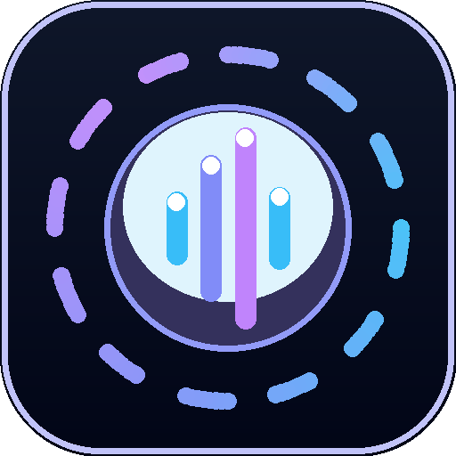
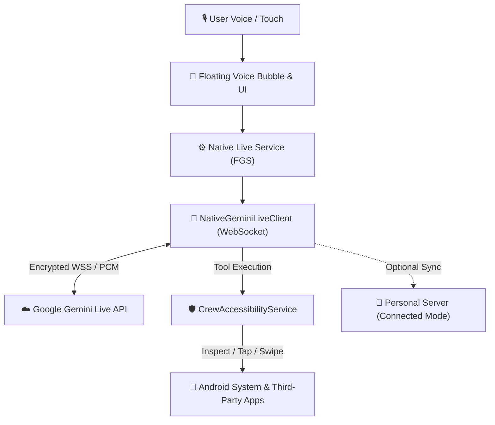

# 🤖 Crew Helper (AI Voice & Automation Copilot)

<p align="center">
  
</p>

<p align="center">
  <strong>Next-Generation Hands-Free AI Voice Assistant & Screen Perception Automation for Android</strong><br>
  次世代 Android 免動手 AI 語音隨身助理與螢幕感知自動化核心
</p>

<p align="center">
  <a href="LICENSE"></a>
  <a href="#"></a>
  <a href="#"></a>
  <a href="docs/privacy.html"></a>
  <a href="#"></a>
</p>

---

<p align="center">
  
</p>

---

## 🌟 Highlights & Features (核心特色)

- 🎙️ **Realtime Bidirectional Voice (Gemini Live)**: Direct Web Audio PCM streaming to Google Gemini Live API. Low latency, fluid, human-like voice conversation without opening a browser.
- 🗣️ **Seamless Voice Interruption**: Built-in fast-path Voice Activity Detection (VAD) and hardware Acoustic Echo Cancellation (AEC). Speak anytime to instantly cut in on AI responses.
- 👁️ **Intelligent Screen Perception (AccessibilityService API)**: Understands on-screen text, buttons, and layouts to execute user-directed voice actions (tap, swipe, type, inspect).
- 🫧 **Universal Floating Voice Bubble**: Quick-access overlay anywhere on Android. Tap to talk, long-press to open command dock and keep-awake toggles.
- 🔒 **BYOK & Zero-Telemetry Privacy**: Bring Your Own Gemini API Key. Keys are encrypted on-device. No telemetry SDKs, no audio stored, and no tracking.
- 🌐 **Bilingual (ZH / EN) Localization**: Instant in-app language switching between Traditional Chinese and English.
- ⚙️ **Dual-Mode Operation**:
  1. **☁️ Standalone Cloud Mode**: Works 100% independently with your Gemini API Key.
  2. **🔗 Connected Server Mode**: Optionally syncs with custom servers for synchronized automation skills.

---

## 🏗️ System Architecture (系統架構)



---

## 🚀 Getting Started (快速開始)

### 1. Download & Installation (下載與安裝)
Download the latest pre-compiled signed APK from [GitHub Releases](../../releases):
- Direct Download: `CrewHelper.apk`

### 2. Get a Free Gemini API Key (申請免費 API 金鑰)
1. Visit [Google AI Studio](https://aistudio.google.com/apikey).
2. Create and copy your Gemini API Key (`AIzaSy...`).
3. Open **Crew Helper** > Tap **⚙️ Operation Mode & Settings** > Paste your API Key.

### 3. Grant Permissions (授予權限)
1. **Accessibility Service**: Tap "Accessibility Service" card, review the Prominent Disclosure, and enable Crew Helper in Android Settings.
2. **Floating Bubble**: Grant "Draw Over Other Apps" permission.
3. **Microphone & Camera**: Allow audio recording for voice sessions.

---

## 🛠️ Building from Source (原始碼編譯)

### Method A: Build with Gradle / Android Studio
```bash
# Clone the repository
git clone https://github.com/magic76/crew-helper.git
cd crew-helper

# Build Debug APK
./gradlew assembleDebug

# Build Release APK & Bundle (AAB)
./gradlew assembleRelease bundleRelease
```

### Method B: Standalone CLI Build (Termux / Linux)
Crew Helper can be built directly in Termux on Android without full Gradle:
```bash
bash build.sh
```
The output APK will be generated at `./CrewHelper.apk`.

---

## 🛡️ Privacy & Compliance (隱私權與合規)

- **Privacy Policy**: Read our full [Privacy Policy Webpage](docs/privacy.html).
- **Accessibility Declaration**: Accessibility APIs are used exclusively for user-prompted screen awareness and automation. Passwords, OTPs, and financial data are strictly excluded from inspection.
- **Data Safety**: Audio streams are ephemeral (realtime in-memory processing only) and encrypted via TLS in transit.

---

## 📄 License (開源授權)

This project is licensed under the [MIT License](LICENSE).
Feel free to fork, customize, and build your own autonomous mobile voice agents!
